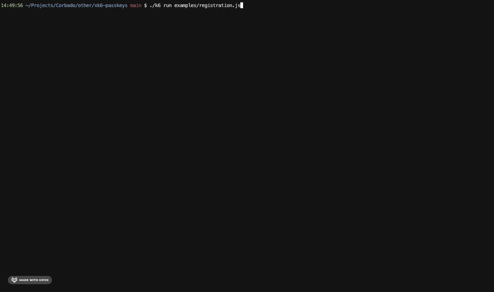
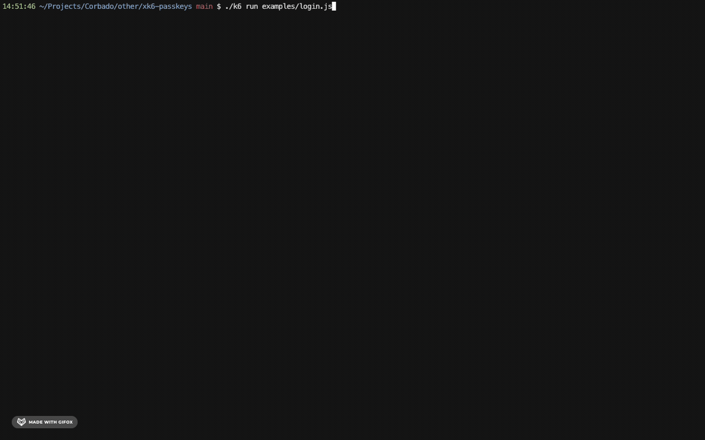

# xk6-passkeys

A k6 extension for load-testing passkey backends ("WebAuthn servers"). With this extension, you can load-test your passkey registration and login flows.

For additional assistance and information, we strongly recommend reading our [blog post about passkey performance testing](https://www.corbado.com/blog/passkey-performance-testing).

## Prerequisites

To build the extension and run the examples, you need the following tools:

- [Go](https://go.dev/doc/install)
- [Git](https://git-scm.com/downloads)
- [Make](https://www.gnu.org/software/make/)
- [Docker](https://docs.docker.com/get-docker/)

## Build

For your convenience, we provide a Makefile to build the extension:

```bash
make build
```

This will create a `k6` binary in the current directory with the extension compiled in.

## Examples

We have implemented two example load-tests in the `examples` directory: one for registration and one for login.

Since a passkeys backend is required for load-testing, we provide a sample backend for load-testing. To start the backend, execute the following commands:

```bash
docker build -t passkeys-backend examples/backend
docker run -p 8080:8080 passkeys-backend
```

🚨 **The backend has been implemented solely for load-testing purposes. It has not been reviewed, secured, thoroughly tested, nor does it adhere to best practices.**

To load-test the registration flow, run the following command (**in a different terminal**):

```bash
./k6 run examples/registration.js
```



To load-test the login flow, run the following command (**in a different terminal**):

```bash
./k6 run examples/login.js
```

